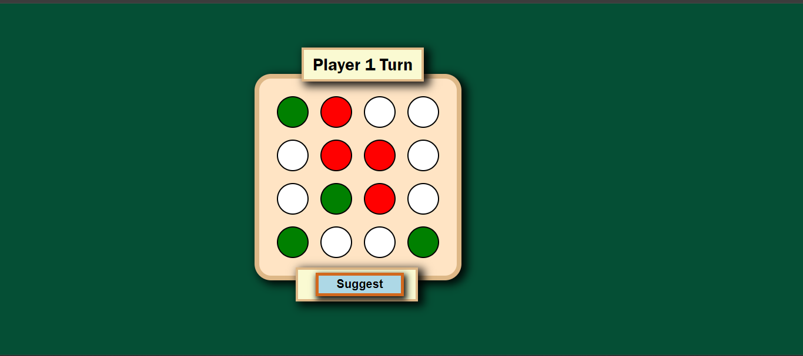

# React Tic-Tac-Toe

Welcome to the React Tic-Tac-Toe game! This is a simple yet fun implementation of the classic Tic-Tac-Toe game using React.js. The game features a clean and responsive design, and allows two players to take turns marking the spaces in a 4X4 grid. The player who succeeds in placing four of their marks in a horizontal, vertical, or diagonal row wins the game.

## Table of Contents

- [React Tic-Tac-Toe](#react-tic-tac-toe)
  - [Table of Contents](#table-of-contents)
  - [Features](#features)
  - [Installation](#installation)
  - [Usage](#usage)
  - [Contributing](#contributing)
  - [License](#license)
  - [Acknowledgments](#acknowledgments)

## Features

- **Responsive Design:** Works well on both desktop and mobile devices.
- **Interactive Gameplay:** Players can take turns, and the game detects win conditions and draws.
- **Clean and Simple UI:** Easy to understand and use interface.
- **State Management:** Efficient use of React hooks to manage the game state.

## Installation

To run this project locally, follow these steps:

1. Clone the repository:
    ```sh
    git clone https://github.com/your-username/react-tic-tac-toe.git
    ```
2. Navigate to the project directory:
    ```sh
    cd react-tic-tac-toe
    ```
3. Install the dependencies:
    ```sh
    npm install
    ```
4. Start the development server:
    ```sh
    npm start
    ```

Your app should now be running on [http://localhost:3000](http://localhost:3000).



## Usage

To play the game, simply open the app in your web browser and start clicking on the grid to place your marks. The game will automatically detect win conditions and announce the winner or a draw.

## Contributing

Contributions are welcome! If you have any ideas, suggestions, or improvements, feel free to fork the repository and submit a pull request.

1. Fork the Project
2. Create your Feature Branch (`git checkout -b feature/AmazingFeature`)
3. Commit your Changes (`git commit -m 'Add some AmazingFeature'`)
4. Push to the Branch (`git push origin feature/AmazingFeature`)
5. Open a Pull Request

## License

This project is licensed under the MIT License. See the [LICENSE](LICENSE) file for details.

## Acknowledgments

- Inspired by the classic Tic-Tac-Toe game
- Built with [React](https://reactjs.org/)

Enjoy playing and happy coding!